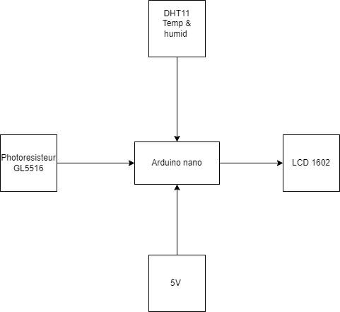
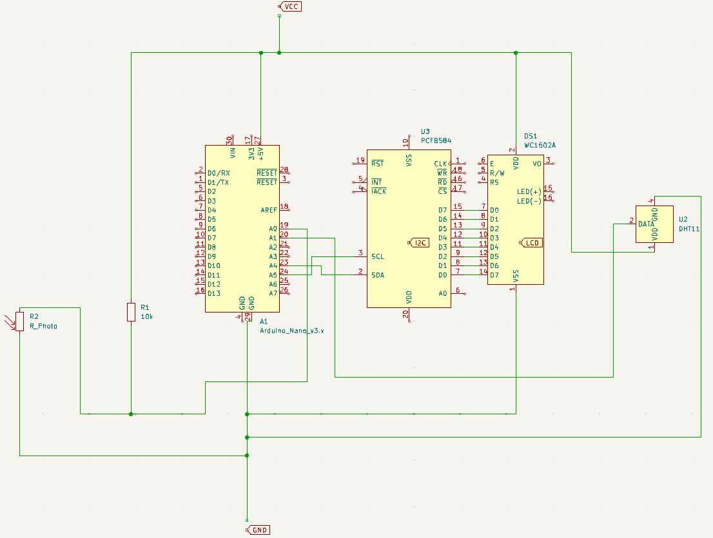

# Station météo 

| | |
|-|-|
|`Author` | Imad-Eddine LFARH |

## Description
Station météo qui dispose d'un thermomètre, hygromètre et d'un capteur de luminosité et qui affiche sur un ecran LCD
## Motivation
Ce projet me permet d'apprendre de nouvelles compétences en électronique, je voulais creer quelque chose d'utile au quotidien, cette station météo me sera tres utile.
 
## Architecture

1. **Arduino Nano** :
   - L'Arduino Nano agit comme le cerveau de votre projet, coordonnant les lectures des capteurs, les calculs et l'affichage sur l'écran LCD.

2. **Capteur DHT (Digital Humidity and Temperature Sensor)** :
   - Ce capteur est utilisé pour mesurer à la fois l'humidité et la température de l'environnement.
   - Il communique avec l'Arduino Nano via une connexion numérique, fournissant des données précises sur l'humidité et la température ambiantes.

3. **Photoresistor GL5516** :
   - Le photoresistor est utilisé pour détecter la luminosité ambiante.
   - Il agit comme un capteur de lumière qui varie sa résistance en fonction de la quantité de lumière incidente.
   - Il est connecté à une broche analogique de l'Arduino Nano pour mesurer cette résistance et déterminer le niveau de luminosité.

4. **Écran LCD 1602** :
   - Cet écran est utilisé pour afficher les données recueillies par les capteurs.
   - Il est connecté à l'Arduino Nano via des broches numériques et est capable d'afficher du texte et des caractères alphanumériques.

### Block diagram

<!-- Make sure the path to the picture is correct -->

### Schematic

### Code
[le code](statiemeteo.ino)

### Components

<!-- This is just an example, fill in with your actual components -->

| Device | Usage | Price |
|--------|--------|-------|
| Arduino |  MicroControlleur | [25 RON](https://www.optimusdigital.ro/ro/compatibile-cu-arduino-nano/1686-placa-de-dezvoltare-compatibila-cu-arduino-nano-atmega328p-i-ch340.html?search_query=Arduino+Nano&results=22) |
| Ecran LCD 1602 avec I2C | Affichage | [17 RON](https://www.optimusdigital.ro/ro/optoelectronice-lcd-uri/2894-lcd-cu-interfata-i2c-si-backlight-albastru.html) |
| Jumper Wires | Connecting components | [7 RON](https://www.optimusdigital.ro/ro/fire-fire-mufate/884-set-fire-tata-tata-40p-10-cm.html?search_query=set+fire&results=110) |
| Breadboard | Project board | [5 RON](https://www.optimusdigital.ro/ro/prototipare-breadboard-uri/44-breadboard-400-points.html) |
| DHT11 | Capteur temp&humid | [7 RON](https://www.optimusdigital.ro/ro/senzori-senzori-de-temperatura/584-senzor-de-temperatura-dht11.html?search_query=dht11&results=17) |
| Photoresisteur GL5516 | capteur lumiere | [2 RON](https://www.conexelectronic.ro/fotorezistori/17746-FOTOREZISTOR-LDR-5-MM-GL5516.html) |

### Libraries

<!-- This is just an example, fill in the table with your actual components -->

| Library | Description | Usage |
|----------|-------------|-------|
| [DHT git](https://github.com/adafruit/DHT-sensor-library) | An Arduino library for the DHT series of low-cost temperature/humidity sensors. | Pour pouvoir utiliser le dht11  |
| [LCD git](https://github.com/blackhack/LCD_I2C/blob/master/src/LCD_I2C.h) | Arduino library to control a 16x2 LCD via an I2C adapter based on PCF8574| Pour pouvoir utiliser l'ecran LCD  |

## Log

<!-- write every week your progress here -->

### Week 6 - 12 May

### Week 7 - 19 May

### Week 20 - 26 May

## Reference links

<!-- Fill in with appropriate links and link titles -->

Lien utiles : 

[Article 1](https://forum.arduino.cc/t/printing-a-float-on-16x2-lcd/325305)
[Article 2](https://forum.arduino.cc/t/c-how-to-get-a-degree-sign-on-a-text-lcd-screen/378588)
[Article 3](https://html.alldatasheet.com/html-pdf/1131893/ETC2/GL5528/110/1/GL5528.html)
[Article 4](https://miscircuitos.com/what-are-the-meaning-of-vdd-vss-vcc-vee-and-gnd/)
